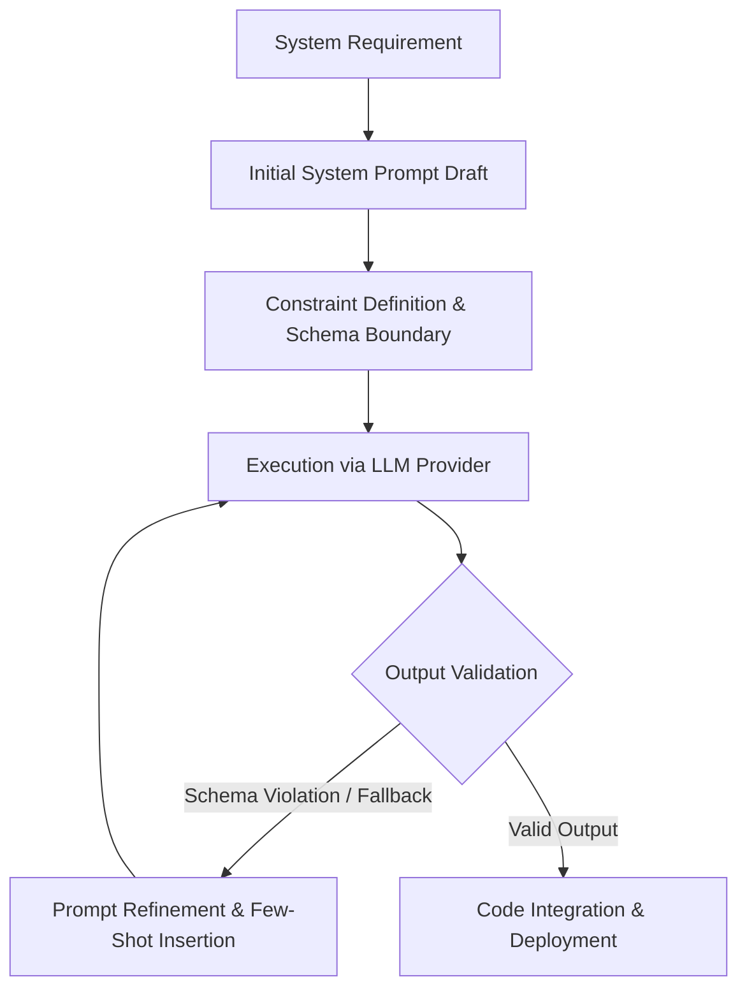

# SATHVIKA_BOINA_THE DEAL BRIEF _Prompt Engineering & AI Workflow Documentation

**Project Name:** Enterprise AI Deal Brief Machine  
**Author:** Sathvika Boina  
**Organization:** Fuse Capital Group Assignment  
**Document Type:** Technical Architecture & Prompt Engineering Documentation  
**Date:** July 2026  
**Status:** Complete / Production Prototype  

---

## Executive Summary

This document presents the software architecture, prompt engineering methodology, and artificial intelligence workflow used in developing the **AI Deal Brief Machine** for Fuse Capital Group. The system is designed to automate middle-market private credit deal evaluation, financial ratio analysis, public web intelligence scraping, lender matching, and 18-section investment memo generation using a multi-agent AI architecture. 

Prompt engineering was utilized not merely for ad-hoc text generation, but as an explicit software design technique to architect modular backend services, structure Next.js frontend interfaces, enforce deterministic financial schema validations, orchestrate multi-agent workflows, and implement robust error-handling pipelines.

---

## 1. Introduction

### 1.1 Purpose of Prompt Engineering in this Project
In modern software engineering, prompt engineering extends beyond basic natural language query crafting. For the AI Deal Brief Machine, prompt engineering served as a structured programming interface to:
1. Translate fuzzy corporate financial parameters into deterministic 18-section credit memos.
2. Direct autonomous AI agents (Validation, Research, Financial, Strategy, Lender Matching, and Report Synthesis) toward targeted analytical execution.
3. Enforce JSON schema validation across multi-agent handoffs without runtime data corruption.
4. Accelerate full-stack application development (FastAPI backend and Next.js 16 frontend) through guided code synthesis, refactoring, and automated unit testing.

### 1.2 Rationale for Large Language Model (LLM) Integration
Middle-market credit evaluation requires synthesizing unstructured text (business descriptions, market trends, competitive positioning) alongside structured numerical metrics (EBITDA, leverage ratios, debt-service coverage ratios). 

Traditional rule-based software struggles with qualitative risk contextualization, while pure statistical models lack structured narrative synthesis. Large Language Models (specifically Google Gemini models and Anthropic Claude architectures) bridge this gap by enabling:
- **Contextual Financial Reasoning**: Evaluating industry-specific debt capacity beyond simple threshold checking.
- **Dynamic Research Synthesis**: Extracting credit signals from live web intelligence.
- **Standardized Output Formatting**: Producing standardized, audit-ready deal briefs formatted according to private equity and private debt standards.

---

## 2. Prompt Engineering Strategy

The prompt engineering strategy adopted throughout development followed an **Iterative Refinement and Constraints-First** paradigm. Rather than using monolithic zero-shot prompts, the development lifecycle utilized specialized system prompts with strict input/output boundaries.



### Core Strategy Objectives:
- **Architecture Design**: Generating modular, decoupled micro-architectures (FastAPI + Pydantic backend, React + TailwindCSS frontend).
- **Workflow Orchestration**: Structuring Server-Sent Events (SSE) streaming progress for multi-agent workflows.
- **UI/UX Aesthetics**: Enforcing modern fintech visual guidelines (dark glassmorphism, HSL color tokens, responsive micro-animations).
- **Report Determinism**: Ensuring generated deal briefs include all 18 standard credit sections with consistent headers and risk metrics.
- **Error Mitigation**: Designing self-healing fallback loops for API rate limits and network exceptions.
- **Code Optimization**: Eliminating redundant re-renders in Next.js components and optimizing Pydantic validation schemas.

---

## 3. Development Prompt Categories

The project utilized 12 distinct prompt engineering categories during the development lifecycle:

| Category | Primary Objective | Key Engineering Technique | Target Output |
| :--- | :--- | :--- | :--- |
| **1. System Architecture** | Define decoupled monorepo boundaries | Contextual domain modeling | FastAPI backend & Next.js layout |
| **2. Backend Development** | Build REST/SSE endpoints | Type-annotated schema enforcement | Asynchronous FastAPI router code |
| **3. Frontend Development** | Create interactive React dashboard | Design system token binding | Next.js 16 TSX components |
| **4. AI Workflow Design** | Sequence sequential agent execution | State transition mapping | Async orchestration pipeline |
| **5. Multi-Agent Workflow** | Isolate agent responsibilities | Specialized role system prompts | 6 Autonomous Agent modules |
| **6. Financial Logic** | Compute leverage & DSCR metrics | Mathematical constraint prompts | Financial risk scoring logic |
| **7. Report Generation** | Compile 18-section deal brief | Structural Markdown framing | Enterprise Deal Brief payload |
| **8. Prompt Chaining** | Transfer output states between agents | Context window passing | Pipeline state transformation |
| **9. Error Handling** | Manage API timeouts & invalid input | Exception boundary framing | Graceful fallback objects |
| **10. UI/UX Refinement** | Deliver high-end visual aesthetic | Utility class & CSS token styling | Glassmorphism & risk badges |
| **11. Code Refactoring** | Ensure clean code & type safety | Static analysis alignment | Production-ready TS/Python code |
| **12. Testing & Debugging** | Diagnose build & runtime issues | Traceback analysis parsing | Fixed TS interfaces & build code |

---

### Deep Dive into Prompt Categories

#### 3.1 System Architecture
- **Objective**: Establish clean separation of concerns between frontend presentation, agent orchestration, and external API interfaces.
- **Prompt Strategy**: Provide domain constraints (FastAPI backend, Next.js frontend, Pydantic validation, client-side history storage) and ask the model to generate directory structure and interface contracts.
- **Expected Output**: Scalable project folder layout, `requirements.txt`, `package.json`, and environment configuration templates.

#### 3.2 Backend Development
- **Objective**: Build asynchronous API routes supporting streaming updates for long-running AI workflows.
- **Prompt Strategy**: Use type hint requirements and specify Server-Sent Events (`EventSource`) protocols for real-time progress notifications.
- **Expected Output**: Clean FastAPI route handlers with error handling, background tasks, and streaming response formatting.

#### 3.3 Frontend Development
- **Objective**: Build responsive Next.js pages with modern UI components and stateful forms.
- **Prompt Strategy**: Request React components built with TypeScript, Framer Motion animations, Lucide icons, and TailwindCSS glassmorphism utilities.
- **Expected Output**: Modular TSX pages (`/new-deal`, `/workflow`, `/deal/[id]`, `/history`) adhering to strict type safety.

#### 3.4 AI Workflow Design
- **Objective**: Map linear and conditional execution paths for deal processing.
- **Prompt Strategy**: Define a state machine where each stage (Validation -> Research -> Financial -> Strategy -> Lender -> Report) emits progress status.
- **Expected Output**: Python orchestrator logic managing execution flow and step-by-step telemetry.

#### 3.5 Multi-Agent Workflow
- **Objective**: Assign dedicated roles to isolated LLM prompt instances to prevent persona context drift.
- **Prompt Strategy**: Construct strict role-based system prompts (e.g., "Act as a Senior Private Debt Financial Analyst...").
- **Expected Output**: Independent prompt functions returning targeted analysis for each stage of the deal pipeline.

#### 3.6 Financial Analysis Logic
- **Objective**: Perform accurate credit analysis including DSCR, leverage ratios, and debt capacity calculations.
- **Prompt Strategy**: Combine deterministic Python math formulas with LLM qualitative risk interpretation to generate objective credit assessments.
- **Expected Output**: Financial risk metrics paired with contextual narrative risk evaluations.

#### 3.7 Report Generation
- **Objective**: Synthesize all agent outputs into a standardized 18-section Enterprise Deal Brief.
- **Prompt Strategy**: Supply exact markdown templates requiring key sections (Executive Summary, Financial Highlights, Recommended Debt Structure, Lender Categories, Risk Assessment, Analyst Notes, Disclaimer).
- **Expected Output**: Structured JSON/Markdown payloads adhering to investment committee formatting.

#### 3.8 Prompt Chaining
- **Objective**: Feed the output of upstream agents directly as input context to downstream agents.
- **Prompt Strategy**: Format intermediate agent results into clean JSON contexts passed into subsequent prompt calls.
- **Expected Output**: Seamless data transformations from raw input parameters to final credit memo.

#### 3.9 Error Handling
- **Objective**: Maintain application stability when external web scraping or LLM APIs fail.
- **Prompt Strategy**: Instruct the LLM to generate robust fallback payloads when JSON parsing or external API calls fail.
- **Expected Output**: Exception handling wrappers with automatic retries and mock fallback generators.

#### 3.10 UI/UX Improvements
- **Objective**: Elevate the visual identity of the application for private credit executives.
- **Prompt Strategy**: Enforce visual rules: dark slate background (`#0f172a`), translucent glass panels (`backdrop-blur-md`), color-coded risk badges (Low = Emerald, Medium = Amber, High = Rose), and micro-animations.
- **Expected Output**: Visual designs and CSS configurations.

#### 3.11 Code Refactoring
- **Objective**: Eliminate duplicate code, resolve strict TypeScript build errors, and ensure maintainability.
- **Prompt Strategy**: Provide existing code snippets and exact error tracebacks, instructing the model to return drop-in replacements maintaining original contracts.
- **Expected Output**: Cleaned codebase passing `npx tsc --noEmit` and production builds.

#### 3.12 Testing & Debugging
- **Objective**: Resolve Vercel deployment issues, monorepo root settings, and package conflicts.
- **Prompt Strategy**: Supply full build logs and terminal output to diagnose build worker exit codes.
- **Expected Output**: Configuration adjustments (`vercel.json`, `next.config.ts`, `package.json`) resolving deployment failures.

---

## 4. Prompt Chaining Workflow

The core intelligence engine operates via **Prompt Chaining**, where each agent executes a specific stage of the deal brief generation process and passes its verified context to the next stage.

### 4.1 Sequential Pipeline Flowchart


### 4.2 Step-by-Step Breakdown

```
Requirement Analysis
       ↓
Architecture Design
       ↓
Backend Development (FastAPI + Pydantic)
       ↓
Frontend Development (Next.js 16 + Tailwind)
       ↓
AI Agent Development (System Prompts)
       ↓
Research Integration (Web Intelligence Scraping)
       ↓
Financial Analysis (DSCR & Leverage Ratios)
       ↓
Report Generation (18-Section Credit Memo)
       ↓
Testing & TypeScript Verification
       ↓
Debugging & Deployment (Vercel)
       ↓
Final Optimization & UX Polish
```

### 4.3 Why Prompt Chaining Improves Consistency and Efficiency
1. **Context Window Isolation**: Passing only relevant upstream summaries prevents context window saturation and reduces LLM processing costs.
2. **Determinism and Verifiability**: Isolating financial calculations into a dedicated stage prevents hallucinated numbers from bleeding into executive summaries.
3. **Fault Tolerance**: If web intelligence scraping fails in Stage 2, the pipeline gracefully proceeds using verified financial inputs from Stage 1 without crashing the entire memo creation process.

---

## 5. Representative Prompt Examples

Below are 7 concrete examples of prompt patterns utilized during the project development lifecycle:

### Example 1: Architecture & Backend API Design
> **Prompt**:  
> *"Design an asynchronous FastAPI router for a middle-market credit evaluation engine. The router must expose a POST endpoint to initialize deal jobs, a GET endpoint to return job status, and an EventSource SSE streaming endpoint to emit real-time stage updates (validation, research, financial, strategy, lender, report)."*  
> **Purpose**: Generates scalable async backend routing with real-time SSE telemetry support.

### Example 2: Financial Ratio & Risk Calculation Prompt
> **Prompt**:  
> *"You are a Senior Credit Officer at a private debt fund. Analyze the following parameters: Revenue = $15M, EBITDA = $4.2M, Requested Debt = $15M, Existing Debt = $1.5M. Calculate Total Leverage (Debt/EBITDA) and estimated Debt Service Coverage Ratio (DSCR). Return a JSON object with risk_level ('Low' | 'Medium' | 'High') and a 2-paragraph financial assessment."*  
> **Purpose**: Combines deterministic debt metrics with narrative risk assessments.

### Example 3: Executive Summary Generation Prompt
> **Prompt**:  
> *"Synthesize the verified company profile, market research data, and credit ratios into a 3-sentence executive summary suitable for an Investment Committee memo. Focus on revenue quality, leverage suitability, and key growth drivers."*  
> **Purpose**: Produces concise executive summaries for history cards and overview headers.

### Example 4: Lender Matching Agent Prompt
> **Prompt**:  
> *"Given a SaaS company seeking $15M senior credit with 0.35x leverage and $4.2M EBITDA, evaluate 4 lender categories (Senior Commercial Banks, Private Debt Funds, Mezzanine Providers, Asset-Based Lenders). Output a structured JSON array containing category_name, likelihood_of_approval ('High' | 'Medium' | 'Low'), and fit_explanation."*  
> **Purpose**: Matches credit profiles to suitable debt capital providers.

### Example 5: Refactoring for Clean Architecture
> **Prompt**:  
> *"Refactor the Next.js DealViewer page to decouple PDF generation, DOCX compilation, and state management. Extract history persistence into a dedicated historyStore module using local storage with custom event subscriptions for cross-component reactivity."*  
> **Purpose**: Ensures clean frontend architecture and code modularity.

### Example 6: Modern Fintech UI/UX Styling Prompt
> **Prompt**:  
> *"Design a modern dark-mode history card component in TailwindCSS. Use glassmorphism utilities (`bg-white/5 border border-white/10 backdrop-blur-md`), color-coded risk badges (Emerald for Low, Amber for Medium, Rose for High), truncated summary text, and action buttons for View, PDF, DOCX, and Delete."*  
> **Purpose**: Establishes consistent, premium visual design tokens.

### Example 7: Debugging and Fallback Handling Prompt
> **Prompt**:  
> *"Write a Python wrapper around the Gemini API client that intercepts JSON decode errors and rate limit exceptions (HTTP 429). Implement exponential backoff retry logic (3 attempts) and return a structured fallback response object if all retries fail."*  
> **Purpose**: Guarantees system resilience under network instability or quota limits.

---

## 6. AI Development Workflow & Tooling

During development, AI assistants (Anthropic Claude & Google Gemini) were integrated into the IDE as pair programmers across six core development dimensions:

```mermaid
grid
    Planning : Architecture & Route Design
    Coding : Component & Endpoint Synthesis
    Debugging : Traceback & Build Error Resolution
    Documentation : Technical Guides & Schemas
    UI Polish : Glassmorphism & Framer Motion
    Validation : Type Checking & Linting
```

- **Planning**: Conceptualized the multi-agent pipeline structure and data transfer schemas before writing code.
- **Coding**: Accelerated code generation for Next.js 16 pages, Framer Motion animations, and FastAPI handlers.
- **Debugging**: Analyzed complex TypeScript build errors (e.g., Zod schema mismatches, missing module type declarations like `@types/file-saver`) to provide instant fixes.
- **Documentation**: Generated standard inline docstrings, API schemas, and full technical architecture documentation.
- **UI Polish**: Refined glassmorphism cards, micro-interactions, dark modes, and responsive breakpoints.
- **Architecture Validation**: Checked type safety across frontend and backend boundaries.

---

## 7. Benefits of Prompt Engineering

Integrating structured prompt engineering into the software development process delivered measurable engineering benefits:

1. **Rapid Prototyping Velocity**: Reduced full-stack development time by generating functional boilerplate and complex UI components rapidly.
2. **Deterministic Output Structure**: Strict JSON schema framing eliminated parsing failures between independent agents.
3. **High Code Quality & Consistency**: Automated linting and type-checking prompts ensured uniform TypeScript and Python style compliance.
4. **Enhanced Maintainability**: Decoupled prompt functions made it easy to update individual agents (e.g., modifying the Lender Matching logic) without breaking the rest of the application.
5. **Self-Healing Resilience**: Embedded fallback patterns ensured that transient API errors did not degrade the end-user experience.

---

## 8. Limitations & Mitigation Controls

While prompt engineering significantly accelerated development, several technical constraints were managed through engineering controls:

| Identified Limitation | Risk Level | Engineering Mitigation Control |
| :--- | :--- | :--- |
| **LLM Hallucination** | High | Deterministic financial calculation preprocessing in Python before prompt insertion. |
| **Schema Instability** | Medium | Strict Pydantic parsing backend side & Zod schema validation frontend side. |
| **API Rate Limits / Quotas** | Medium | Asynchronous exponential backoff retries with local mock fallback mechanisms. |
| **Session Volatility** | Low | Client-side LocalStorage persistence with custom event-driven UI re-rendering. |

> [!IMPORTANT]  
> **Production Deployment Note:**  
> This prototype stores deal history locally in the browser (`LocalStorage`) for demonstration purposes. In a production enterprise deployment, this state would be backed by a persistent relational database (e.g., PostgreSQL with Row-Level Security) and secured behind enterprise authentication (OAuth2 / OIDC).

---

## 9. Conclusion

Prompt engineering served as a core software engineering methodology in building the **AI Deal Brief Machine**. By treating prompts as typed, modular specifications within a multi-agent architecture, the system transforms complex financial inputs and unstructured web data into structured, investment-grade credit memos. 

The resulting platform demonstrates how combining modern web frameworks (Next.js 16, TailwindCSS, FastAPI) with disciplined prompt engineering delivers an enterprise-grade prototype for Fuse Capital Group.
